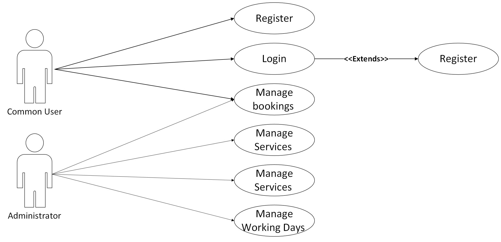
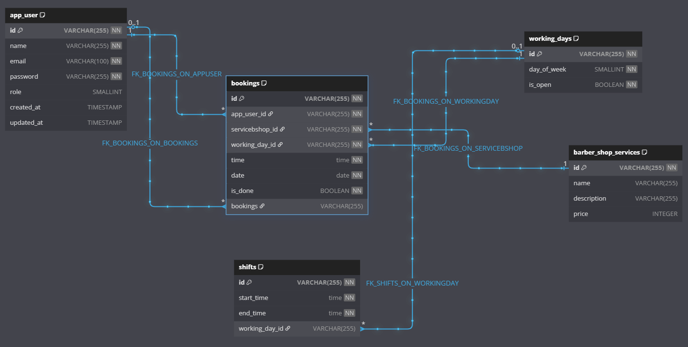

# 💈BarberShop 

Este é um sistema de gerenciamento para uma barbearia, desenvolvido com **Angular** e **Spring Boot**. O objetivo do sistema é gerenciar agendamentos, serviços, horários de funcionamento e outras operações relacionadas à administração de uma barbearia.

## 📋 Funcionalidades

### **Frontend (Angular)**  
 
- **Gerenciamento de Agendamentos**:
  - Visualização de agendamentos com filtros por data.
  - Adição, edição e exclusão de agendamentos.
- **Gerenciamento de Serviços**:
  - Cadastro de novos serviços.
  - Atualização e exclusão de serviços existentes.
- **Horários de Funcionamento**:
  - Configuração de horários de trabalho por dia da semana.
  - Adição de turnos personalizados.
- **Interface Responsiva**:
  - Design adaptado para dispositivos móveis e desktops.
  - Uso de Angular Material para componentes estilizados.

### **Backend (Spring Boot)**
- **APIs RESTful**:
  - Endpoints para gerenciar agendamentos, serviços e horários.
- **Banco de Dados**:
  - Persistência de dados usando JPA/Hibernate.
- **Validação e Segurança**:
  - Validação de dados no backend.
  - Configuração de segurança básica para proteger as APIs.

---

## 🛠️ Tecnologias Utilizadas

### **Frontend**
- **Angular**: Framework para construção de interfaces de usuário.
- **Angular Material**: Biblioteca de componentes UI.
- **Bootstrap**: Gerenciamento de estados assíncronos.
- **Moment.js**: Manipulação de datas.
- **SCSS**: Estilização avançada.
- **Nginx**: Servidor web para servir a aplicação Angular em produção.

### **Backend**
- **Spring Boot**: Framework para construção de APIs RESTful.
- **Hibernate/JPA**: Mapeamento objeto-relacional.
- **PostgreSQL**: Banco de dados relacional.
- **Lombok**: Redução de boilerplate no código Java.

### 📊 Diagramas

#### **Diagrama de Caso de Uso**


#### **Diagrama de Classes e Relacionamento**



## 🚀 Como Executar o Projeto

### **Executando com Docker Compose**

1. Certifique-se de ter o **Docker** e o **Docker Compose** instalados em sua máquina.
2. Clone o repositório do projeto:
   ```bash
   git clone https://github.com/seu-usuario/barber-shop-angular-spring.git
   cd barber-shop-angular-spring
   ```
3. Execute o comando para iniciar os serviços:
   ```bash
   docker-compose up -d --build
   ```
4. Acesse o frontend no navegador em `http://localhost:80` e a API backend em `http://localhost:8080`.

5. Para parar os serviços, utilize:
   ```bash
   docker-compose down
   ```

---

Com isso, o sistema estará pronto para uso em um ambiente local utilizando containers Docker.